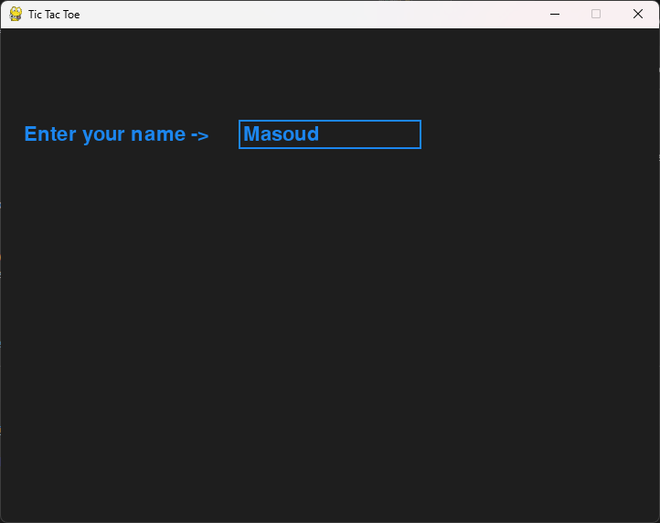
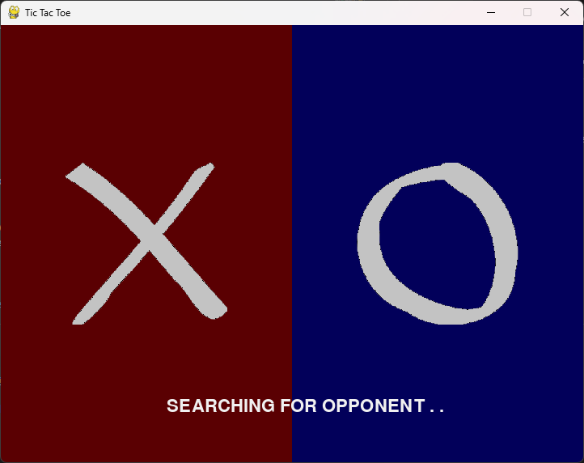
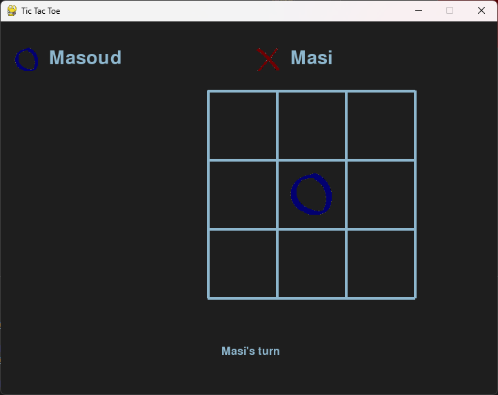
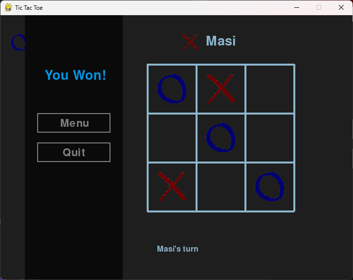

<h1 align="center">Tic Tac Toe (Python Socket + Pygame)</h1>

<p align="center">
A simple network multiplayer Tic Tac Toe game built with Python sockets (server/client) and a Pygame GUI.  <br>
Supports board sizes: 3×3, 4×4, 5×5.
</p>


## Features
- Multiplayer over TCP sockets (client/server)
- Pygame graphical interface
- Board size selection: 3×3 / 4×4 / 5×5
- Matchmaking: players are paired based on selected board size
- Turn-based gameplay enforced by the server
- Win detection on the server

---

### Project Structure
```
.
├── ./images/screenshots/         # UI assets (X/O images)
├── client.py       # Pygame client
├── server.py       # Socket server + game logic
└── report.pdf      # Project report 
```

---

### Requirements
- Python 3
- pygame
  
  
Install dependencies:
```
pip install pygame
```


### How to Run
1) Start the server

    In a terminal:

    ```
    python server.py
    ```
    The server listens on port 12345.

2) Start clients (two players)

    Open two terminals (or run on two machines in the same network):
    ```
    python client.py
    ```
    Enter a name, select board size, and wait for an opponent.

--- 

### Notes
- Win rules are implemented for each board size in server.py.  
    - **3×3:** 3 in a row
    - **4×4:** 3 in a row
    - **5×5:** 4 in a row
- The game is designed for 2 players per match (no spectators, no chat).

---
<!-- Enter Name -->
<p style="text-align: center;"><strong>Enter Name</strong></p>
<div style="text-align: center;">
  
  <br>
</div>

<!-- Select Board Size -->
<p style="text-align: center;" ><strong>Select Board Size</strong></p>
<div style="text-align: center;">
  
  <br>
</div>

<!-- Waiting for Opponent -->
<p style="text-align: center;"> <strong>Waiting for Opponent</strong></p>
<div style="text-align: center;">
  
  <br>
</div>

<!-- Gameplay -->
<p style="text-align: center;"><strong>Gameplay</strong></p>
<div style="text-align: center;">
  
  <br>
</div>

<!-- Result Screen -->
<p style="text-align: center;"><strong>Result Screen</strong></p>
<div style="text-align: center;">
  
</div>